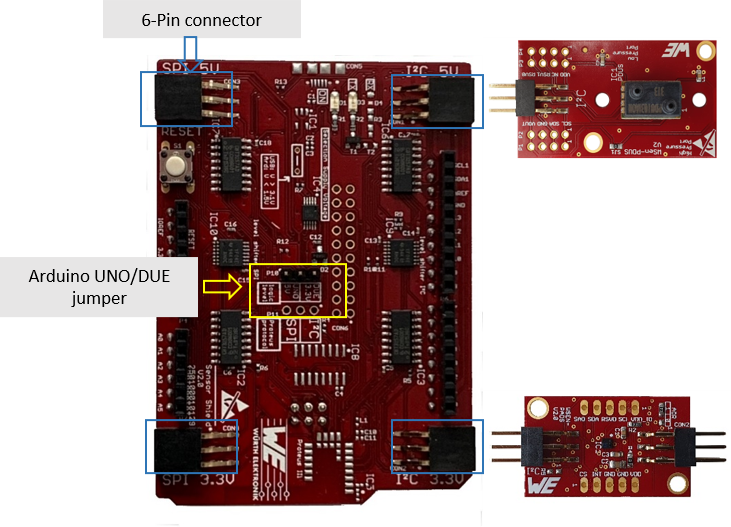
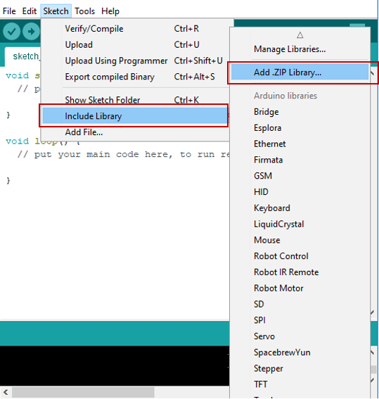
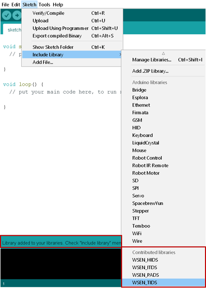
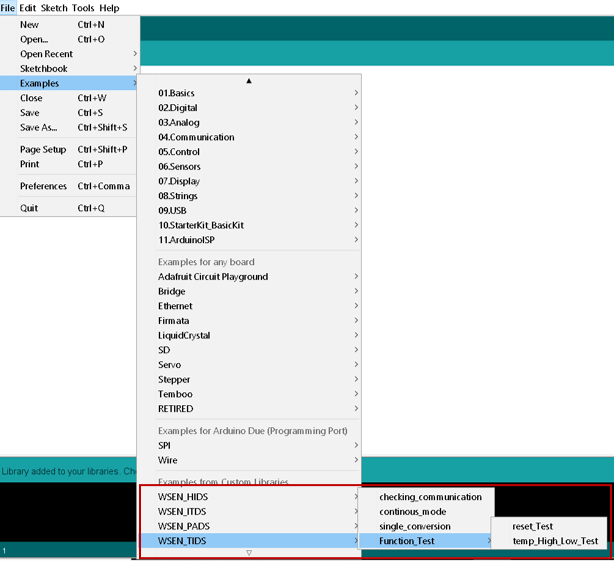
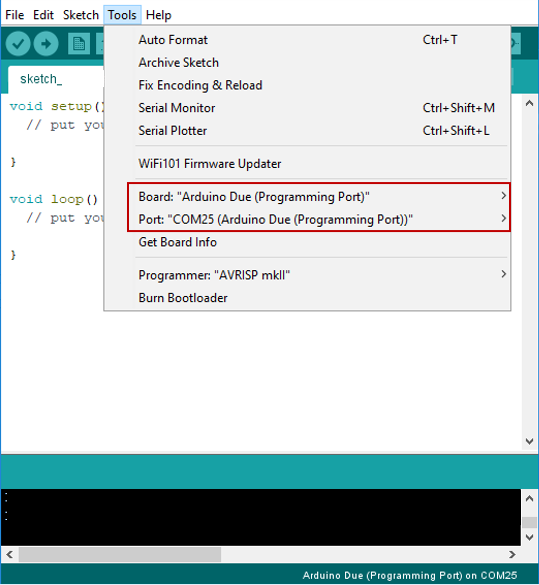
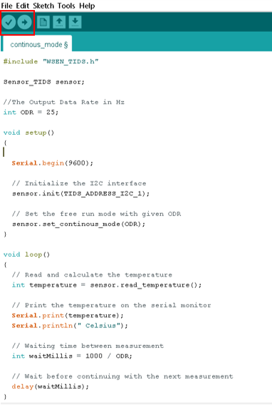

# WE Sensor libraries for Arduino

[Würth Elektronik](https://www.we-online.com/wco) offers a range of [sensors](https://www.we-online.de/katalog/en/wco/sensors) including temperature, pressure, humidity and acceleration sensor. In order to enable quick prototyping and evaluation of these sensors, Würth Elektronik offers libraries for the [Arduino platform](https://www.arduino.cc/). Arduino is an open-source electronics platform based on easy-to-use hardware and software ideal for rapid prototyping. The sensor [evaluation boards](https://www.we-online.de/katalog/en/wco/sensors/evaluation_boards_wsen), the [Arduino shield](https://www.we-online.de/katalog/en/wco/sensors/evaluation_boards_wsen) and these libraries provide all the tools necessary to get started with your application. 

## Hardware

### WE sensor evaluation boards

The evaluation boards for sensors provide a versatile hardware platform to enable easy verification of sensors. The sensor evaluation board can be used in multiple configurations,
* Placed on a breadboard
* Connected to Raspberry-Pi using the [Amber-Pi](https://www.we-online.de/katalog/en/AMBER_PI_SENSORS)
* Connected to [Arduino Uno](https://store.arduino.cc/arduino-uno-rev3) or [Arduino DUE](https://store.arduino.cc/arduino-due) using the Arduino shield.

### WE Sensors shield for Arduino

The WE sensor shield acts as an adapter board for connecting WE sensor evaluation boards to Arduino UNO/DUE. It is a versatile hardware platform that offers I2C and SPI interfaces at 3.3 V and 5 V signal levels. Additionally, this board can be extended to have a wireless connectivity module from Würth Elektronik ([Thyone-I](https://www.we-online.de/katalog/en/THYONE-I)/[Proteus-III](https://www.we-online.de/katalog/en/PROTEUS-III)).

## Sensor libraries for the Arduino platform 

This repository contains the source code for all the sensor libraries from Würth Elektronik. Each library is placed under the folder with WSEN-XXXX where XXXX corresponds to the sensor type.

|Match code   | Sensor type  |
|---|---|
|[WSEN-TIDS](https://www.we-online.de/katalog/en/WSEN-TIDS)  | Temperature sensor  |
|[WSEN PADS](https://www.we-online.de/katalog/en/WSEN-PADS)  |Absolute pressure sensor |
|[WSEN-HIDS](https://www.we-online.de/katalog/en/WSEN-HIDS)   | Humidity sensor |
|[WSEN-ITDS](https://www.we-online.de/katalog/en/WSEN-ITDS)|Acceleration sensor|
|[WSEN-PDUS](https://www.we-online.de/katalog/en/WSEN-PDUS)  | Differential pressure sensor  |

Each of these folders contain two sub folders

* Src - This folder contains the source code for the sensor library and all the necessary drivers

* Examples - This folder contains sample code for using the library.

### Importing the WE sensor library into Arduino IDE

1. Download/clone repository and create a zip file of the sensor folder of interest. Alternatively, Each individual library is available for download as a **zip** package from https://www.we-online.com/web/en/electronic_components/produkte_pb/service_pbs/wco/software/softwareuebersicht.php

2. Open the Arduino IDE. 

3. As shown in the image below, navigate to **Sketch > Include Library > Add .ZIP Library.** in the Arduino IDE. Select the option to **"Add .ZIP Library"**.  

4. On successful import, on the **Sketch > Include Library menu** menu, you should see, as shown in the image bellow, the added libraries at the bottom of the drop-down menu.  

Now, the libraries are ready to be used in your sketch.  

### Running the example code

After adding the needed library to the sketch, you are able now to run one sensor example and get the corresponding Output Values.  
The examples can be found under **File>Examples>Example from custom libraries** 

1. Open the example of interest by browsing to **File>Examples>Example from custom libraries** 

2. Select the correct COM and programming port for the Arduino.

3. Compile and upload the example selected.

4. The output can be viewed on the serial monitor.
